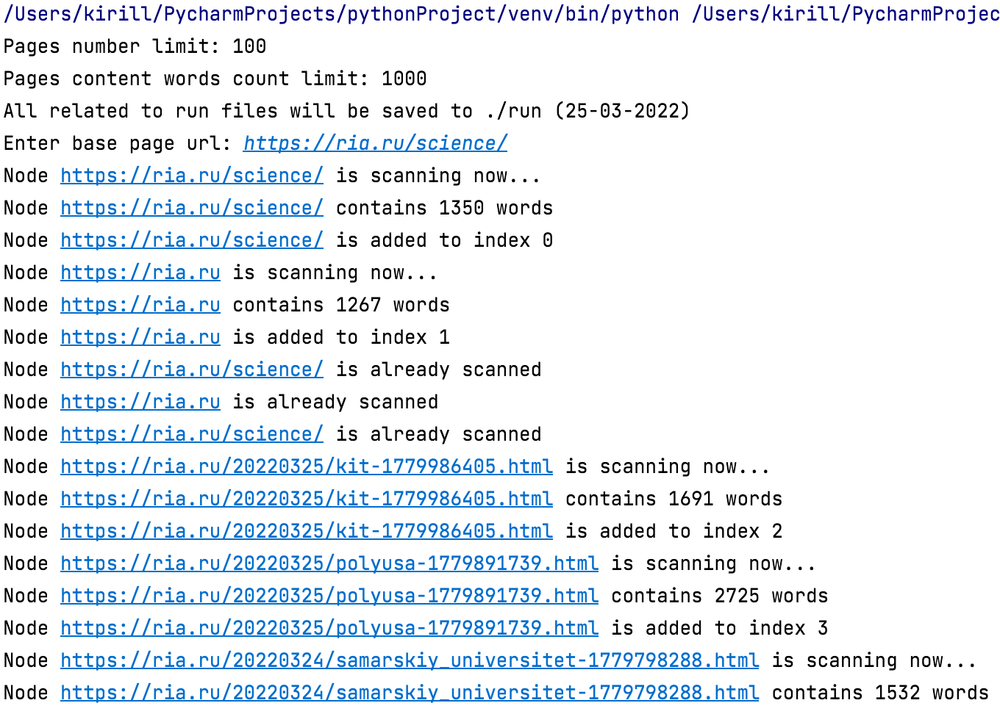
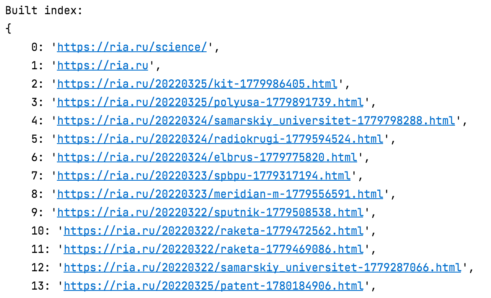

####input:
- URL

####output:
- 100 текстовых файлов с содержимым (>= 1000 слов каждый) страницы
index.txt - карта {номер страницы}: ‘веб-адрес страницы’

####algorithm:
1. Получить содержимое страницы по введенным веб-адресам
2. Извлечь все ссылки <a href=”...” /a>
3. Очистить все тэги html
4. Если содержимое страницы >= 1000 слов, то сохранить его в файл “номер страницы: адрес страницы”
5. Пока количество сохраненных страницы < 100: повторить для каждой ссылки

####error notification:
- Неверный входной адрес
- Дерево страниц может содержать менее 100 подходящих страниц

В результате выполнения программы получим:

- Выкачанные страницы - `run(01-04-2022)/content/`
- Индекс - `run(01-04-2022)/index.txt`

