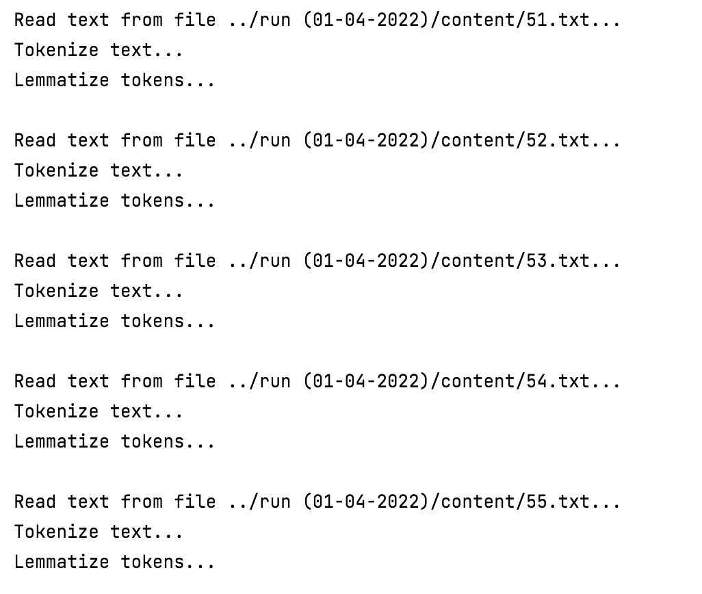
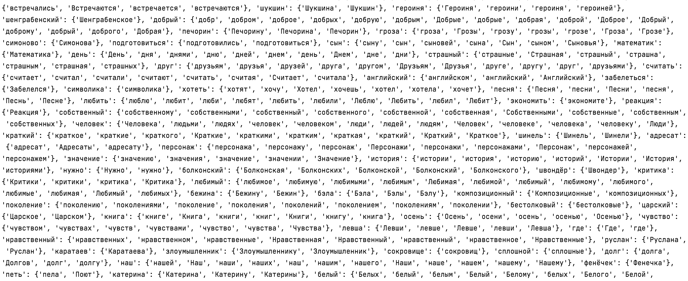
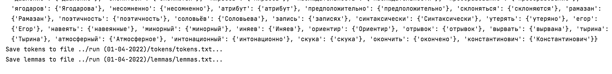

- используется только русский язык. нерусские языки, цифры, предлоги и т.д. игнорируются 

В результате выполнения программы получим:

- Токены - `run(01-04-2022)/tokens/tokens.txt`
- Леммы - `run(01-04-2022)/lemmas/lemmas.txt`